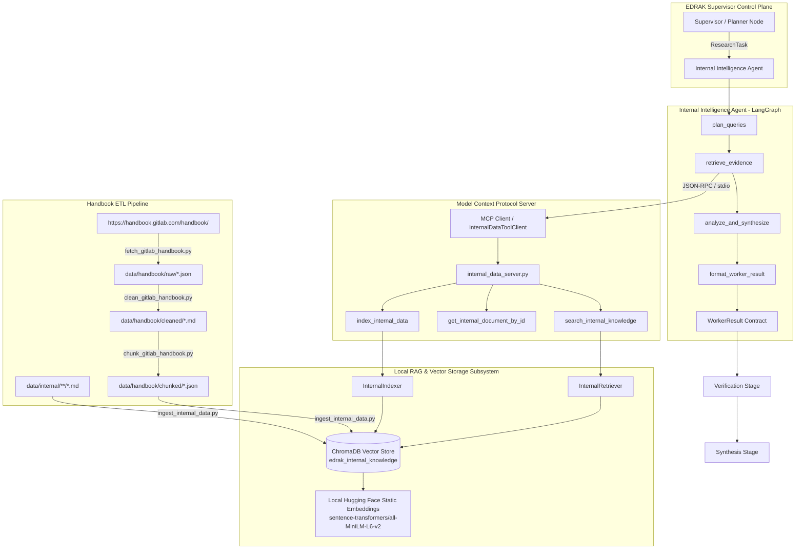

# EDRAK — Internal Intelligence Feature & Architecture Guide

This document provides a comprehensive overview and architectural specification of the **Internal Intelligence Agent**, the **Internal Data MCP Server**, the **RAG (Retrieval-Augmented Generation) Subsystem**, the **GitLab Company Profile Dataset**, the **GitLab Handbook ETL Pipeline**, and the **End-to-End Flow Testing Suite** within EDRAK.

---

## 1. Feature Overview & Purpose

The **Internal Intelligence Agent** is one of the four specialized worker agents in EDRAK. Its primary responsibility is to analyze the pilot company's (**GitLab**) internal strategic posture, including:

- **Product Architecture & Capabilities**: GitLab Duo AI features, latency benchmarks, multi-model routing via AI Gateway, self-hosted and air-gapped readiness.
- **Pricing, Packaging & Commercial Terms**: GitLab Duo Agent Platform, usage-based GitLab Credits, tier allowances (Premium: $12/user/mo; Ultimate: $24/user/mo), and legacy add-ons (Pro/Enterprise).
- **Telemetry & Adoption Metrics**: Active seat utilization, customer churn triggers, CSAT scores, enterprise sentiment.
- **Strategic OKRs & Values**: GitLab public handbook values (Collaboration, Results, Efficiency, Diversity/Inclusion/Belonging, Iteration, Transparency - CREDIT), 2026 "Act 2" restructuring, and quarterly roadmaps.

### Internal vs. External Data Governance
- **Public GitLab Handbook**: Real data scraped and cleaned directly from [GitLab Handbook](https://handbook.gitlab.com/handbook/).
- **Confidential Internal Information**: Because internal GitLab telemetry/OKRs are confidential, synthetic internal files are generated under `data/internal/` and marked with explicit provenance tags (`source_type: SourceType.SYNTHETIC_INTERNAL`, `is_synthetic: True`).

---

## 2. End-to-End Architecture



---

## 3. Shared Contracts Compliance (`backend/src/edrak/contracts/`)

All domain workers strictly communicate through the immutable contracts defined in `edrak.contracts`:

| Contract | Schema & Purpose |
| :--- | :--- |
| **`CompanyProfile`** | Defines company baseline (`name`, `aliases`, `products`, `notes`). |
| **`ResearchTask`** | Formal instruction dispatched by the Orchestrator (`task_id`, `parent_request_id`, `worker`, `goal`, `focus`, `company_profile`, `business_context`, `attempt`). |
| **`Evidence`** | Grounded proof item with provenance (`evidence_id`, `source_type`, `source_title`, `source_url`, `extracted_fact`, `excerpt`, `retrieved_at`, `is_synthetic`, `metadata`). |
| **`Finding`** | Analytical claim linked to evidence (`finding_id`, `statement`, `category`, `evidence_refs`, `confidence`, `limitations`). |
| **`WorkerResult`** | Complete output contract with referential integrity (`task_id`, `worker`, `status`, `attempt`, `findings`, `evidence`, `gaps`, `conflicts`, `confidence`, `metadata`). |

---

## 4. GitLab Company Profile (`data/profiles/` & `edrak.core.profiles`)

A rich, comprehensive company profile is available across the system:

* **Static JSON Profile**: `data/profiles/gitlab_profile.json`
* **Comprehensive Architecture & Strategic Markdown**: `data/profiles/gitlab-company-profile.md`
* **Python In-Memory Contract & Loaders**: `backend/src/edrak/core/profiles.py`

### Python Usage:
```python
from edrak.core.profiles import GITLAB_COMPANY_PROFILE, get_gitlab_profile, get_detailed_gitlab_profile

# Standard contract instance
profile = get_gitlab_profile()

# Full detailed profile dictionary (financials, leadership, Act 2 strategy, competitive positioning)
detailed_info = get_detailed_gitlab_profile()
```

---

## 5. Component Breakdown

### A. Internal Intelligence Agent (`backend/src/edrak/agents/internal_intelligence/`)
Follows the standard LangGraph worker package structure:

| File | Purpose |
| :--- | :--- |
| `graph.py` | State machine: `plan_queries` ➔ `retrieve_evidence` ➔ `analyze_synthesize` ➔ `format_result` ➔ `END`. |
| `state.py` | Defines `InternalAgentState` (`task`, `queries`, `retrieved_evidence`, `findings`, `limitations_and_gaps`, `summary`, `worker_result`, `error`). |
| `nodes.py` | Implements query planning, semantic retrieval over MCP/RAG, posture analysis, finding categorization, and result packaging. |
| `prompts.py` | System prompts guiding the worker to analyze internal strengths, telemetry weaknesses, packaging constraints, and strategic alignment. |

### B. Internal Data MCP Server (`mcp_servers/internal_data_server.py`)
Exposes reusable internal data access tools via Model Context Protocol (MCP) over `stdio`:

- `search_internal_knowledge(query: str, top_k: int = 4, doc_type: Optional[str] = None)`: Semantic search over indexed handbook chunks and internal documents.
- `get_internal_document_by_id(chunk_id: str)`: Exact chunk retrieval.
- `index_internal_data(force_reset: bool = False)`: Re-indexes internal files into ChromaDB.

### C. RAG Subsystem (`backend/src/edrak/rag/`)

| File | Purpose |
| :--- | :--- |
| `embeddings.py` | Local Hugging Face static embeddings (`sentence-transformers/all-MiniLM-L6-v2`) ensuring zero network latency and vector consistency. |
| `indexer.py` | Header-aware markdown chunking, metadata attachment, and vector upserts in ChromaDB. |
| `retriever.py` | Semantic vector search, confidence calculation, and construction of strongly-typed `Evidence` objects. |

---

## 6. Manual Execution & CLI Guide

To run any step of the pipeline manually:

### Environment Setup
Make sure your environment variables and Python path are set:
```powershell
# In PowerShell
$env:PYTHONPATH="backend/src;backend;scripts;."
```
```bash
# In Bash
export PYTHONPATH="backend/src:backend:scripts:."
```

---

### Step 1: Run Handbook ETL Pipeline

#### Option A: Full Automated Run (Fetch ➔ Clean ➔ Chunk ➔ Ingest)
```bash
# Crawl 25 pages and ingest:
python scripts/run_etl_pipeline.py --all --max-pages 25 --reset

# Or full unlimited crawl:
python scripts/run_etl_pipeline.py --all --max-pages 0 --reset
```

#### Option B: Step-by-Step Manual ETL
```bash
# 1. Scrape raw handbook pages
python scripts/fetch_gitlab_handbook.py --url https://handbook.gitlab.com/handbook/ --max-pages 25

# 2. Clean HTML into Markdown
python scripts/clean_gitlab_handbook.py

# 3. Chunk Markdown into semantic units
python scripts/chunk_gitlab_handbook.py --chunk-size 1000 --overlap 150

# 4. Ingest Chunks and Internal Data into ChromaDB
python scripts/ingest_internal_data.py --reset
```

---

### Step 2: Start Internal Data MCP Server
To run the MCP server over stdio for external agent integration:
```bash
python mcp_servers/internal_data_server.py
```

---

### Step 3: Run the Internal Intelligence Worker Directly
You can run a research task through Python or an interactive script:
```python
from edrak.contracts.request import BusinessContext, CompanyProfile, UseCase
from edrak.contracts.task import ResearchTask, WorkerType
from edrak.agents.internal_intelligence.graph import run_internal_intelligence

task = ResearchTask(
    parent_request_id="req_manual_001",
    worker=WorkerType.INTERNAL_INTELLIGENCE,
    goal="Evaluate GitLab Duo architecture and pricing strategy against GitHub Copilot",
    focus="Duo Agent Platform, AI Gateway, zero retention data privacy, GitLab Credits",
    company_profile=CompanyProfile(name="GitLab"),
    business_context=BusinessContext(
        use_case=UseCase.COMPETITIVE_INTELLIGENCE,
        targets=["GitHub", "Azure DevOps"],
    ),
)

result = run_internal_intelligence(task)
print(f"Status: {result.status.value}")
print(f"Findings: {len(result.findings)}")
print(f"Evidence items: {len(result.evidence)}")
```

---

### Step 4: Run Automated Tests
```bash
# Run all unit tests
python -m pytest backend/tests/test_contracts.py backend/tests/test_internal_agent.py backend/tests/test_rag.py -v

# Run the complete end-to-end lifecycle flow test
python -m pytest backend/tests/test_internal_flow.py -v -s
```

---

## 7. Verified Test Output Example

```text
======================================================================
WORKER RESULT CONTRACT OUTPUT (Comprehensive Inspection)
======================================================================
Task ID:       task_internal_gitlab_duo_eval
Worker:        internal_intelligence
Status:        completed
Metadata:      {"query_count": 2, "evidence_count": 6, "finding_count": 6, "summary": "..."}

--- [1] STRUCTURED FINDINGS (Sample) ---
  Finding #1 [ID: 61e050ce-79c2-4822-a9b3-1fcfb7cb62ea]:
    Category:       pricing_packaging
    Confidence:     0.89
    Evidence Refs:  ['c0dbd06d-495c-4da6-90e2-7634fb72ca3c']
    Statement:      "GitLab Duo is packaged as an add-on subscription to GitLab Premium and Ultimate tiers."

--- [2] CITED EVIDENCE POOL (Sample) ---
  Evidence #1 [ID: c0dbd06d-495c-4da6-90e2-7634fb72ca3c]:
    Title:          Gitlab Pricing And Packaging
    Source URL:     data/internal/pricing/gitlab_pricing_and_packaging.md
    Source Type:    synthetic_internal
    Retrieved At:   2026-10-05T06:18:25.102391+00:00
    Extracted Fact: "GitLab Duo is packaged as an add-on subscription to GitLab Premium and Ultimate tiers."
    Metadata:       {'is_synthetic': True, 'search_query': '...'}

--- [3] LIMITATIONS AND GAPS ---
  • Internal company data is adapted/synthetic for GitLab pilot demonstration purposes in accordance with project constraints.

[JSON Schema Validation] WorkerResult successfully validates and serializes to standard contract JSON.
======================================================================
ALL FLOW TESTS PASSED SUCCESSFULLY!
======================================================================
```
