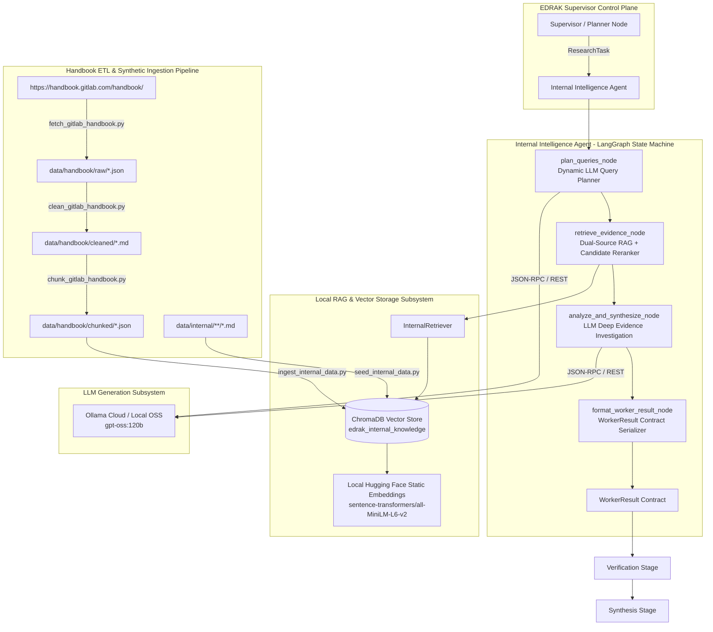

# EDRAK — Internal Intelligence Feature & Architecture Guide

This document provides a comprehensive overview and architectural specification of the **Internal Intelligence Agent**, the **Internal Data MCP Server**, the **RAG (Retrieval-Augmented Generation) Subsystem**, the **GitLab Company Profile Dataset**, the **GitLab Handbook ETL Pipeline**, and the **End-to-End Flow Testing Suite** within EDRAK.

---

## 1. Feature Overview & Purpose

The **Internal Intelligence Agent** is one of the four specialized worker agents in EDRAK. Its primary responsibility is to analyze the pilot company's (**GitLab**) internal strategic posture, including:

- **Product Architecture & Capabilities**: GitLab Duo AI features, latency benchmarks, multi-model routing via AI Gateway, self-hosted and air-gapped readiness.
- **Pricing, Packaging & Commercial Terms**: GitLab Duo Agent Platform, usage-based GitLab Credits, tier allowances (Premium: $29/mo with $12 promotional credits; Ultimate: $24 promotional credits), Free tier pools ($25,000 cap), and legacy add-ons (Pro/Enterprise).
- **Telemetry & Adoption Metrics**: Active seat utilization, customer churn triggers, CSAT scores, enterprise sentiment, ARR cohorts (> $100k ARR: 1,519 orgs, +18% YoY; > $1M ARR: 155 enterprises), NRR (118%), and SaaS share (34% of ARR, +36% YoY).
- **Strategic OKRs & Values**: GitLab public handbook values (CREDIT), 2026 "Act 2" restructuring, and quarterly roadmaps.

### Internal vs. External Data Governance
- **Public GitLab Handbook**: Real data scraped and cleaned directly from [GitLab Handbook](https://handbook.gitlab.com/handbook/).
- **Confidential Internal Information**: Because internal GitLab telemetry/OKRs are confidential, synthetic internal files are generated under `data/internal/` and marked with explicit provenance tags (`source_type: SourceType.SYNTHETIC_INTERNAL`, `is_synthetic: True`).

---

## 2. End-to-End Architecture



---

## 3. Shared Contracts Compliance (`backend/src/edrak/contracts/`)

All domain workers strictly communicate through the immutable contracts defined in `edrak.contracts`:

| Contract | Schema & Key Fields | Purpose |
| :--- | :--- | :--- |
| **`CompanyProfile`** | `name`, `aliases`, `products`, `notes` | Company baseline data. |
| **`ResearchTask`** | `task_id`, `parent_request_id`, `worker`, `goal`, `focus`, `company_profile`, `business_context`, `attempt` | Formal instruction dispatched by the Orchestrator. |
| **`Evidence`** | `evidence_id`, `source_type`, `source_title`, `source_url`, `extracted_fact`, `excerpt`, `retrieved_at`, `is_synthetic`, `metadata` | Grounded proof item with provenance and similarity scores. |
| **`Finding`** | `finding_id`, `statement`, `category`, `claim_type`, `scope`, `supporting_quote`, `evidence_refs`, `confidence`, `limitations` | First-class analytical claim strictly grounded in evidence. |
| **`Conflict`** | `finding_id`, `contradicting_evidence_ids`, `description` | Discrepancies or roadmap tensions between sources. |
| **`WorkerResult`** | `task_id`, `worker`, `status`, `attempt`, `findings`, `evidence`, `gaps`, `conflicts`, `confidence`, `metadata` | Complete output contract with strict referential integrity. |

---

## 4. Configuration & Environment Variables (`backend/src/edrak/core/config.py`)

All model endpoints, embeddings, paths, and reranking thresholds are fully configurable via `.env`:

```bash
# LLM Generation
LLM_PROVIDER=ollama
LLM_MODEL=gpt-oss:120b
LLM_BASE_URL=https://ollama.com/v1
LLM_API_KEY=your_api_key_here
LLM_TEMPERATURE=0.2

# Embedding Configuration (Local Hugging Face)
EMBEDDING_PROVIDER=huggingface
EMBEDDING_MODEL_NAME=sentence-transformers/all-MiniLM-L6-v2
EMBEDDING_DIMENSION=384

# Internal Intelligence Worker Reranking & Retrieval Settings
INTERNAL_RERANK_SCORE_CUTOFF=0.58
INTERNAL_RERANK_MAX_ITEMS=12
INTERNAL_RERANK_MIN_ITEMS=5

# Data Storage Paths
VECTOR_STORE_PATH=data/vector_store
INTERNAL_DATA_PATH=data/internal
RAW_HANDBOOK_PATH=data/handbook/raw
CLEANED_HANDBOOK_PATH=data/handbook/cleaned
CHUNKED_HANDBOOK_PATH=data/handbook/chunked
ARTIFACTS_PATH=artifacts
CHROMA_COLLECTION_NAME=edrak_internal_knowledge
```

---

## 5. Scripts & CLI Tooling Reference (`scripts/`)

| Script | Purpose | Key Arguments |
| :--- | :--- | :--- |
| **`scripts/run_internal_agent.py`** | Standalone runner for the Internal Intelligence Worker LangGraph state machine. | `--goal <str>`, `--focus <str>`, `--json-output`, `--save-to <path>` |
| **`scripts/seed_internal_data.py`** | Seeds synthetic internal strategic documents into ChromaDB and runs 5 verification probes. | `--data-dir <path>`, `--chroma-dir <path>` |
| **`scripts/ingest_internal_data.py`** | Ingests chunked handbook and internal documents into ChromaDB with header prefixing and text validation. | `--reset`, `--skip-handbook`, `--skip-internal` |
| **`scripts/run_etl_pipeline.py`** | Full automated handbook ETL pipeline orchestrator. | `--all`, `--max-pages <N>`, `--reset` |
| **`scripts/fetch_gitlab_handbook.py`** | Scrapes raw handbook HTML and saves raw JSON responses. | `--url <URL>`, `--max-pages <N>`, `--output-dir <path>` |
| **`scripts/clean_gitlab_handbook.py`** | Converts raw HTML into clean GitHub-flavored Markdown. | `--input-dir <path>`, `--output-dir <path>` |
| **`scripts/chunk_gitlab_handbook.py`** | Chunks cleaned Markdown into semantic units with YAML frontmatter. | `--chunk-size <N>`, `--overlap <N>` |

---

## 6. Execution & Verification Examples

### Running Specific Research Goals

#### Goal 1: Duo Architecture, Packaging & Copilot
```powershell
python scripts/run_internal_agent.py \
  --goal "Assess GitLab Duo product architecture, packaging, and internal OKRs vs GitHub Copilot" \
  --focus "GitLab Duo Agent Platform, AI Gateway, zero retention data privacy, GitLab Credits, and self-hosted readiness" \
  --save-to artifacts/reports/internal_worker_result_duo_copilot.json
```

#### Goal 2: Commercial Monetization Shift & ARR Telemetry
```powershell
python scripts/run_internal_agent.py \
  --goal "Evaluate GitLab commercial monetization shift, GitLab Credits consumption, and enterprise ARR cohorts" \
  --focus "Hybrid seat plus consumption credits, Premium and Ultimate tier allowances, Flex commitment pools, NRR, and ARR growth" \
  --save-to artifacts/reports/internal_worker_result_pricing_telemetry.json
```

#### Goal 3: AI Gateway Architecture & Air-Gapped Security
```powershell
python scripts/run_internal_agent.py \
  --goal "Analyze GitLab AI Gateway architecture, model selection policies, and self-hosted air-gapped security" \
  --focus "Intelligent Model Selection, static vs dynamic routing proxy, zero data retention, and customer-managed local LLM inference" \
  --save-to artifacts/reports/internal_worker_result_privacy_airgap.json
```

---

## 7. Automated Test Suite Breakdown (`backend/tests/`)

The repository includes a comprehensive, multi-layer testing suite covering unit tests, contract integrity, text utilities, and end-to-end integration flows:

```text
backend/tests/
├── test_contracts.py       # Pydantic contract schemas & referential integrity
├── test_rag_text_utils.py  # Markdown parsing, heading prefixing & text algorithms
├── test_internal_agent.py  # LangGraph state machine & coverage scenarios
├── test_internal_flow.py   # Full post-fetch pipeline integration test
└── test_rag.py             # Vector indexer & retriever unit tests
```

### Detailed Breakdown of Test Files

| Test File | Key Test Cases & Coverage | Verification Purpose |
| :--- | :--- | :--- |
| **`test_contracts.py`** | • `test_business_request_creation`<br>• `test_research_task_creation`<br>• `test_worker_result_validation`<br>• `test_verification_decision`<br>• `test_gitlab_company_profile` | Validates Pydantic schema validation, enum boundaries, and referential integrity (ensuring all `Finding.evidence_refs` resolve to `Evidence.evidence_id`). |
| **`test_rag_text_utils.py`** | • `TestHeaderParsing` (doc_id, last_updated, classification, body split)<br>• `TestTitlePrefix` (`# {title}\n## {heading}` chunk prefixing)<br>• `TestAsBool` (prevents `bool("False") == True` bugs)<br>• `TestExtractedFact` (query-relevance scoring & fact extraction)<br>• `TestCategoryClassifier` (ordered category classification rules)<br>• `TestCreditsVsValues` (commercial credits vs corporate CREDIT values disambiguation)<br>• `TestNodeExecutionAndContracts` (node execution & timestamp assertions) | 8 unit test suites validating all text utilities, heading-aware chunking, frontmatter parsing, category classifier rules, and node execution. |
| **`test_internal_agent.py`** | • `test_mock_partial_coverage_scenario`<br>• `test_mock_all_focus_areas_completed_scenario`<br>• `test_live_knowledge_base_query` | Validates LangGraph state machine behavior under partial coverage (`WorkerStatus.PARTIAL`) vs complete coverage (`WorkerStatus.COMPLETED`), and validates live vector queries. |
| **`test_internal_flow.py`** | • `test_full_internal_flow` | Full 5-step lifecycle integration test: Clean HTML ➔ Semantic Chunking ➔ ChromaDB Ingestion ➔ Vector Retrieval ➔ LangGraph Agent execution to a serialized `WorkerResult`. |
| **`test_rag.py`** | • `test_internal_indexer_and_retriever` | Isolated temporary ChromaDB collection test verifying embedding generation, chunk indexing, and semantic similarity search. |

---

## 8. Running Automated Tests

```powershell
# Run all unit tests across contracts, RAG utils, and isolated RAG
pytest backend/tests/test_contracts.py backend/tests/test_rag_text_utils.py backend/tests/test_rag.py -v

# Run the LangGraph agent scenario tests
pytest backend/tests/test_internal_agent.py -v

# Run the complete end-to-end post-fetch flow test
pytest backend/tests/test_internal_flow.py -v -s
```
