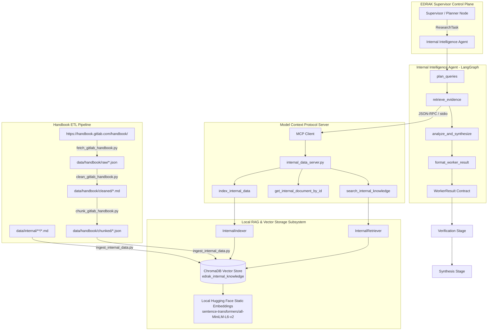

# EDRAK — Internal Intelligence Feature & Architecture Guide

This document provides a comprehensive overview and architectural specification of the **Internal Intelligence Agent**, the **Internal Data MCP Server**, the **RAG (Retrieval-Augmented Generation) Subsystem**, the **GitLab Handbook ETL Data Pipeline**, and the **End-to-End Flow Testing Suite** within EDRAK.

---

## 1. Feature Overview & Purpose

The **Internal Intelligence Agent** is one of the four specialized worker agents in EDRAK. Its primary responsibility is to analyze the pilot company's (**GitLab**) internal strategic posture, including:

- **Product Architecture & Capabilities**: GitLab Duo AI features, latency benchmarks, multi-model routing, self-hosted and air-gapped readiness.
- **Pricing, Packaging & Commercial Terms**: GitLab Duo Pro ($19/seat/mo), GitLab Duo Enterprise ($39/seat/mo), add-on tiers vs. bundled competitor offerings.
- **Telemetry & Adoption Metrics**: Active seat utilization, customer churn triggers, CSAT scores, enterprise sentiment.
- **Strategic OKRs & Values**: GitLab public handbook values (Results, Efficiency, Diversity, Iteration, Transparency, Collaboration - CREDIT) and quarterly product roadmaps.

### Internal vs. External Data Governance
- **Public GitLab Handbook**: Real data scraped and cleaned directly from [GitLab Handbook](https://handbook.gitlab.com/handbook/).
- **Confidential Internal Information**: Because internal GitLab telemetry/OKRs are confidential, synthetic internal files are generated under `data/internal/` and marked with explicit provenance tags (`source_type: "internal_doc"`).

---

## 2. End-to-End Architecture



---

## 3. Component Breakdown

### A. Internal Intelligence Agent (`backend/src/edrak/agents/internal_intelligence/`)
Follows the standard LangGraph worker package structure:

| File | Purpose |
| :--- | :--- |
| `backend/src/edrak/agents/internal_intelligence/graph.py` | Defines the state machine graph: `plan_queries` ➔ `retrieve_evidence` ➔ `analyze_and_synthesize` ➔ `format_worker_result` ➔ `END`. |
| `backend/src/edrak/agents/internal_intelligence/state.py` | Defines `InternalAgentState` containing the input `ResearchTask`, generated queries, retrieved `Evidence` pool, internal analysis text, and final `WorkerResult`. |
| `backend/src/edrak/agents/internal_intelligence/nodes.py` | Implements query planning, semantic retrieval over MCP/RAG, posture analysis, and finding generation. |
| `backend/src/edrak/agents/internal_intelligence/prompts.py` | System prompts instructing the agent to focus on internal strengths, telemetry weaknesses, packaging constraints, and strategic alignment. |

### B. Internal Data MCP Server (`mcp_servers/internal_data_server.py`)
Exposes reusable internal data access tools to any agent via standard Model Context Protocol (MCP) over `stdio`:

- `search_internal_knowledge(query: str, top_k: int = 4, doc_type: Optional[str] = None)`: Semantic search over indexed handbook chunks and internal documents.
- `get_internal_document_by_id(chunk_id: str)`: Exact chunk retrieval.
- `index_internal_data(force_reset: bool = False)`: Re-indexes internal files into ChromaDB.

### C. RAG Subsystem (`backend/src/edrak/rag/`)

| File | Purpose |
| :--- | :--- |
| `backend/src/edrak/rag/embeddings.py` | Provides local Hugging Face static embeddings (`sentence-transformers/all-MiniLM-L6-v2` via ONNX or sentence-transformers) ensuring zero network dependencies, fast vector generation, and static query/document vector consistency. |
| `backend/src/edrak/rag/indexer.py` | Manages header-aware markdown chunking, sliding window paragraphs, metadata attachment, and persistent vector upserts in ChromaDB. |
| `backend/src/edrak/rag/retriever.py` | Performs vector search, calculates distance-to-confidence scores, and constructs strongly-typed `Evidence` objects with provenance metadata. |

---

## 4. GitLab Handbook ETL Pipeline (`scripts/`)

A 4-stage data pipeline designed for modularity, idempotence, and auditability:

```text
data/
├── handbook/
│   ├── raw/         # Stage 1: Scraped raw JSON records with full HTML & timestamps
│   ├── cleaned/     # Stage 2: Parsed, stripped markdown documents with frontmatter
│   └── chunked/     # Stage 3: Semantic heading chunks with source URLs & IDs
├── internal/        # Domain markdown: pricing, product, telemetry, sales, handbook
└── vector_store/    # ChromaDB persistent SQLite & vector index files
```

### Pipeline Scripts:
1. **`scripts/fetch_gitlab_handbook.py`**: Scrapes `https://handbook.gitlab.com/handbook/`, strips tracking parameters (`utm_source`), and saves raw JSON records to `data/handbook/raw/`.
2. **`scripts/clean_gitlab_handbook.py`**: Strips navigation, footers, breadcrumbs, ads, and scripts. Converts HTML into clean Markdown with frontmatter to `data/handbook/cleaned/`.
3. **`scripts/chunk_gitlab_handbook.py`**: Splits content on markdown headers (`#`, `##`, `###`) and sliding paragraphs into semantic chunks in `data/handbook/chunked/`.
4. **`scripts/ingest_internal_data.py`**: Upserts handbook chunks and `data/internal/` documents into ChromaDB with local Hugging Face static embeddings.
5. **`scripts/run_etl_pipeline.py`**: Master CLI runner (`--all`, `--fetch`, `--clean`, `--chunk`, `--ingest`, `--reset`).

---

## 5. How to Ingest All Data / Entire GitLab Handbook

To ingest the entire GitLab Handbook site into the ChromaDB vector database:

### Option 1: Single Master Command (Recommended)
Run the automated ETL pipeline with `--max-pages 0` (unlimited crawl) and `--reset` (cleans and rebuilds ChromaDB):
```bash
python scripts/run_etl_pipeline.py --all --max-pages 0 --reset
```

> **Tip**: If you want to crawl a specific number of pages (e.g., 50 or 200 pages):
> ```bash
> python scripts/run_etl_pipeline.py --all --max-pages 50 --reset
> ```

---

### Option 2: Step-by-Step Execution

#### Step 1: Crawl the GitLab Handbook Site
```bash
python scripts/fetch_gitlab_handbook.py --url https://handbook.gitlab.com/handbook/ --max-pages 0
```

#### Step 2: Clean the Scraped HTML into Markdown
```bash
python scripts/clean_gitlab_handbook.py
```

#### Step 3: Chunk the Markdown into Semantic Units
```bash
python scripts/chunk_gitlab_handbook.py --chunk-size 1000 --overlap 150
```

#### Step 4: Ingest Everything into ChromaDB
```bash
python scripts/ingest_internal_data.py --reset
```

---

## 6. End-to-End Post-Fetch Flow Testing (`backend/tests/test_internal_flow.py`)

A unified test module `backend/tests/test_internal_flow.py` validates the complete pipeline post-fetch in 5 sequential stages:

```
[STEP 1: CLEAN]   Raw HTML JSONs ➔ Clean Markdown (data/handbook/cleaned/)
        ↓
[STEP 2: CHUNK]   Clean Markdown ➔ Semantic Header Chunks (data/handbook/chunked/)
        ↓
[STEP 3: INGEST]  Chunks & Internal Docs ➔ ChromaDB (edrak_internal_knowledge)
        ↓
[STEP 4: RETRIEVE] Semantic Vector Query ➔ Typed Evidence Objects
        ↓
[STEP 5: AGENT]   LangGraph Agent Execution (ResearchTask ➔ WorkerResult)
```

### Running the End-to-End Test:
```bash
# Run standalone test script
python backend/tests/test_internal_flow.py

# Or run via pytest test runner alongside all unit/integration tests
pytest backend/tests/test_internal_flow.py -v
```

### Verified Execution Output & Contract Breakdown:
```text
======================================================================
WORKER RESULT CONTRACT OUTPUT (Comprehensive Inspection)
======================================================================
Task ID:       task_internal_gitlab_duo_eval
Worker Role:   internal_intelligence
Status:        success
Completed At:  2026-10-04T17:26:32.914275+00:00
Metadata:      {"query_count": 4, "evidence_count": 10, "finding_count": 10}

--- [1] HIGH-LEVEL SUMMARY ---
Internal Intelligence Assessment for 'Assess GitLab Duo product architecture, pricing tiers, and internal telemetry metrics vs GitHub Copilot':
- Analyzed 10 internal evidence sources across product architecture, commercial tiers, and strategy.
• [PRICING_AND_COMMERCIALS] GitLab Duo is packaged as an add-on subscription to GitLab Premium and Ultimate tiers.
• [COMPETITIVE_POSITIONING] Self-hosted & air-gapped deployment availability (GitLab Duo on self-managed).
• [INTERNAL_TELEMETRY] 142,000 active paid seats across GitLab Pro & Enterprise add-ons.

--- [2] STRUCTURED FINDINGS (Sample) ---
  Finding #1 [ID: find_internal_9b2e0481]:
    Domain Topic:   pricing_and_commercials
    Confidence:     0.89
    Evidence Refs:  ['ev_internal_3d4b6841']
    Statement:      "GitLab Duo is packaged as an add-on subscription to GitLab Premium and Ultimate tiers."
    Metadata:       {'source_title': 'Gitlab Pricing And Packaging', 'source_uri': 'data/internal/pricing/gitlab_pricing_and_packaging.md'}

--- [3] CITED EVIDENCE POOL (Sample) ---
  Evidence #1 [ID: ev_internal_3d4b6841]:
    Title:          Gitlab Pricing And Packaging
    Source URI:     data/internal/pricing/gitlab_pricing_and_packaging.md
    Source Type:    internal_doc
    Confidence:     0.89
    Timestamp:      2026-10-04T17:26:32.802145+00:00
    Content Excerpt:"# GitLab Duo Pricing, Packaging & Commercial Strategy  ## Pricing Structure (Add-on Model) GitLab Duo is packaged as an add-on subscription..."
    Metadata:       {'filename': 'gitlab_pricing_and_packaging.md', 'search_query': 'What is the add-on pricing model for GitLab Duo Pro and Enterprise?'}

--- [4] LIMITATIONS AND GAPS ---
  • Internal company data is adapted/synthetic for GitLab pilot demonstration purposes in accordance with project constraints.

[JSON Schema Validation] WorkerResult successfully validates and serializes to standard contract JSON.
======================================================================
ALL FLOW TESTS PASSED SUCCESSFULLY! (Clean -> Chunk -> Ingest -> Retrieve -> Agent)
======================================================================
```

---

## 7. Configuration & Environment Variables

Configure `.env` in the workspace root (refer to `.env.example`):

```dotenv
# ==============================================================================
# LLM Generation (Ollama Cloud / Local OSS)
# ==============================================================================
LLM_PROVIDER=ollama
LLM_MODEL=gpt-oss:120b
LLM_BASE_URL=https://ollama.your-cloud-endpoint.com/v1
LLM_API_KEY=your_ollama_cloud_api_key_here
LLM_TEMPERATURE=0.2

# ==============================================================================
# Local Hugging Face Static Embeddings
# ==============================================================================
EMBEDDING_PROVIDER=huggingface
EMBEDDING_MODEL_NAME=sentence-transformers/all-MiniLM-L6-v2
EMBEDDING_DIMENSION=384

# ==============================================================================
# Data Storage & RAG Paths
# ==============================================================================
VECTOR_STORE_PATH=data/vector_store
INTERNAL_DATA_PATH=data/internal
RAW_HANDBOOK_PATH=data/handbook/raw
CLEANED_HANDBOOK_PATH=data/handbook/cleaned
CHUNKED_HANDBOOK_PATH=data/handbook/chunked
ARTIFACTS_PATH=artifacts
CHROMA_COLLECTION_NAME=edrak_internal_knowledge
```

---

## 8. Command Reference

| Command | Description |
| :--- | :--- |
| `python scripts/run_etl_pipeline.py --all --max-pages 0 --reset` | Ingests the **entire** handbook into ChromaDB. |
| `python scripts/run_etl_pipeline.py --all --max-pages 25 --reset` | Runs the ETL pipeline for a specific page limit. |
| `python backend/tests/test_internal_flow.py` | Runs the full automated verification test (Clean ➔ Chunk ➔ Ingest ➔ Retrieve ➔ LangGraph Agent). |
| `pytest backend/tests/ -v` | Runs all unit and integration tests (6/6 passing). |
| `python mcp_servers/internal_data_server.py` | Starts the Model Context Protocol (MCP) server over stdio. |
