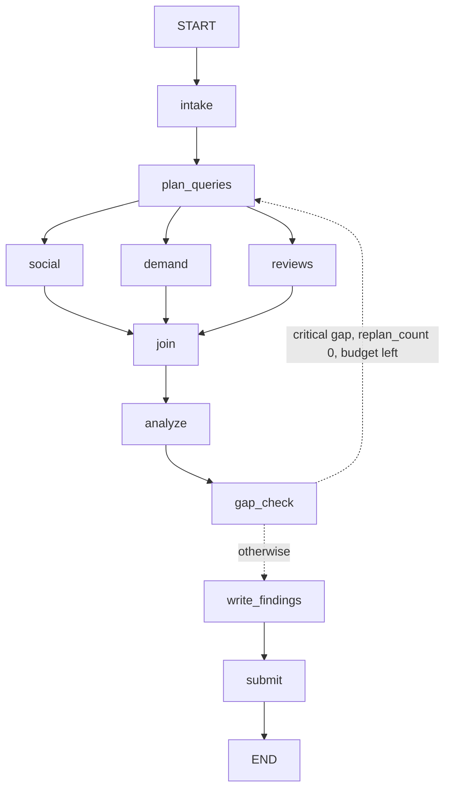

# Architecture

To be extended as the graph and tools land. The normative design is in [SPEC.md](SPEC.md).

## Provider layer

Every external data source sits behind the `Provider` protocol in `providers/base.py`:
a `name`, a set of `capabilities` and `async call(capability, params) -> ProviderResult`.
Tools never talk to a provider directly. They call `ProviderRegistry.call`, which owns routing,
fallback, caching, the budget and the circuit breaker.

```
tool -> ProviderRegistry.call(capability, params)
          budget.check_before_call()
          for provider in routing[capability]:        # config/providers.yaml
              skip if unregistered, unsupported or breaker-open
              cache hit?  -> return it
              provider.call(...)  -> success: breaker reset, cache put, return
                                  -> ProviderError: breaker failure, try the next one
          nothing served -> ProviderExhausted(failures)
          budget.record(cost)   # one tool call per registry call
```

### Capability names

`<kind>` or `<kind>:<variant>`: `web_search`, `fetch_page`, `search_interest`,
`social_search:<platform>`, `social_comments:<platform>`, `reviews:<store>`,
`news:gdelt`, `news:google_news`. `make_capability` and `parse_capability` validate them.

### Call params

A plain dict, validated by `CallParams`: `run_id`, `task_id`, `query`, `languages`, `geo`,
`since`, `until`, `max_results`, `cursor`, `post_url`, `hashtags`, `sort` (`recent` or `top`),
and for the demand and review capabilities `keywords`, `timeframe`, `target` (an app id, or a
product id or URL) and `country`.
Providers stamp `batch_id="pending"` on the evidence they build; the evidence store assigns the
real batch id on insert.

### Results

`ProviderResult` carries `items` (evidence items or trend series), `raw_count`,
`cost_estimate` (USD), `next_cursor`, `warnings`, `partial`, free-form `meta`, and, set by
the registry, `provider` and `fallback_used`. `fallback_used` is true when the provider that
served the call is not the first in the routing order, including when earlier ones are not
configured. A partial result (for example a quota ran out midway) is never cached.

### Failures

`ProviderNotConfigured` (credentials rejected), `ProviderRateLimited`, `ProviderQuotaExceeded`,
`ProviderUnavailable` and `ProviderBadResponse` are the only errors providers raise. The
registry also turns unexpected parsing errors (validation, key and type errors) into
`ProviderBadResponse` so a bad payload becomes fallback, not a crash. Error messages never
contain request URLs, because those can carry credentials.

### HTTP

`providers/http.py::request_json` retries 429, 5xx, timeouts and connection failures three
times with exponential backoff and jitter. 401 and 403 mean rejected credentials, 402 a usage
limit, other 4xx and malformed JSON a bad response; none of those are retried. A provider can
pass an `error_mapper` to classify its own error bodies (YouTube reports quota problems inside
403 responses). `RateLimiter` enforces a minimum interval between request starts, per provider.

### Fallback API keys

Apify and SocialCrawl accept more than one key. `APIFY_TOKEN` and `SOCIALCRAWL_API_KEY` are the
first choice; `APIFY_FALLBACK_TOKENS` and `SOCIALCRAWL_FALLBACK_API_KEYS` hold comma separated
backups (`Settings.key_list` joins them, dropping blanks and repeats; a provider is also set up
from fallbacks alone). Each provider holds a `KeyRing` (`providers/keys.py`) and runs every call
through `with_failover`: a key that answers with `ProviderQuotaExceeded` (usage or credit limit,
or a SocialCrawl balance too low for the request) or `ProviderNotConfigured` (rejected key) is
passed over, the call is repeated with the next key, and the ring stays on the working key for
later calls. Rate limits, server errors and failed actor runs do not rotate. When every key has
failed, the last key's error is raised and the registry falls back to the next provider as usual.
A rotation is logged as `api_key_rotated` with the position in the list, never the key.

### Budget, breaker, cache

- `BudgetTracker` refuses a call that would cross the tool-call, cost or time limit and records
  what each call used.
- `CircuitBreaker` opens a provider after three consecutive failures and keeps it open for the
  rest of the run. A missing key does not count: such providers are simply not registered.
- `DiskCache` stores successful results under `<data_dir>/cache/<sha256>.json` for
  `EDRAK_CACHE_TTL_S` seconds. The key covers the provider, the capability and the canonical
  params, but not `run_id` and `task_id`; a cache hit is re-stamped for the current run.

### Fixture mode

With `EDRAK_PROVIDER_MODE=fixture` the registry builds no providers and opens no HTTP client.
It serves recorded results from `backend/tests/customer_trends/fixtures/providers/`.

File name: the capability with `:` replaced by `.`, plus `.json`: `web_search` is
`web_search.json`, `social_search:reddit` is `social_search.reddit.json`, `news:gdelt` is
`news.gdelt.json`.

File content: one serialized `ProviderResult`. `provider` names the provider the recording
imitates (it becomes the result's provider; `fixture` if empty). Items keep the run and task ids
of the recording; the registry re-stamps them for the current run. `max_results` truncates the
items. Cost is reported as zero. A missing or invalid fixture raises `ProviderExhausted` with a
failure from the pseudo-provider `fixture`, which tools report as a gap.

### Providers

| Provider | Capabilities | Notes |
|---|---|---|
| `serper` | `web_search`, `news:google_news`, `social_search:<platform>` (x, reddit, tiktok, instagram, facebook) | Needs `SERPER_API_KEY`. Snippet-level data, `snippet_only=true`. Social search is a `site:` query and always carries a warning. Local adapter until the shared web MCP server exists (SPEC 8.4). |
| `gdelt` | `news:gdelt` | No key. About 90 days of history, `sourcelang:` filter, results are titles only. Volume by day is computed from the returned articles. |
| `youtube_api` | `social_search:youtube`, `social_comments:youtube` | Needs `YOUTUBE_API_KEY`. Local quota counter in `<data_dir>/youtube_quota.json`, reset at midnight Pacific time. |
| `apify` | `social_search:{x,tiktok,instagram,youtube,reddit}`, `social_comments:*`, `search_interest`, `reviews:{app_store,google_play,amazon}` | Needs `APIFY_TOKEN`. One actor per capability, configured in providers.yaml. |
| `socialcrawl` | `social_search:*`, `social_comments:*` (all six platforms), `search_interest` | Needs `SOCIALCRAWL_API_KEY`. One response shape for every platform; Google Trends through its own endpoint. |
| `google_trends_api` | `search_interest` | Stub, always registered so its routing entry resolves. `ProviderNotConfigured` without `GOOGLE_TRENDS_API_KEY`, then `ProviderUnavailable("alpha api not implemented")`. |

### Apify

`providers/apify/client.py` runs an actor with `POST /v2/acts/{owner~name}/run-sync-get-dataset-items`
(bearer token, `limit` and `timeout` as query parameters, the actor input as the body). The
sync route answers 201. A 408, or a 400 `run-failed`, means the run timed out or crashed: it
is reported as `RunNotFinished` (a `ProviderUnavailable` that is never retried, because running
the actor again costs again). 401 and 403 are `ProviderNotConfigured`, 402 is
`ProviderQuotaExceeded`, 429 is retried.

Per capability, `config/providers.yaml` names the actor, an input template, value translations
and a price. A template uses placeholders such as `{query}`, `{max_results}`, `{sort}`,
`{window}`, `{url}`, `{keywords}`, `{target}`. A string that is exactly one placeholder keeps
the value's type; a key whose placeholder has no value is left out so the actor keeps its
default; `requires` lists the values a capability cannot run without. `enabled: false` switches
a capability off without removing its config.

`providers/apify/mappers.py` is the only place that knows actor output field names. Each mapper
turns one dataset item into an `EvidenceItem` (or a `TrendSeries` for Google Trends) and keeps
unmapped small fields in `metadata`. Cost is estimated as the run fee plus the per-item price
times the items returned; Apify reports no cost on this route.

### SocialCrawl

`providers/socialcrawl.py` sends `GET <base_url><path>` with an `x-api-key` header. Which path,
query parameter, sort values, page size and credit price apply to each capability is in
providers.yaml. Responses share one envelope: `data.items[]` with a `post` or `comment`,
`pagination.next_cursor` (sent back verbatim as `cursor`) and `credits_used` /
`credits_remaining`. Searches send `relevance=filter`, which drops rows that are not about the
query at no extra credit. Rows in other languages than requested are dropped with a warning.
A request that could cost five credits or more first reads the free `GET /credits/balance`
and raises `ProviderQuotaExceeded` when the balance is short; paging stops early when the
balance runs out. A comments request for a post without comments (404 `RESOURCE_NOT_FOUND`) is
an empty result.

### Routing and cost

The order of providers per capability in `config/providers.yaml` is cheapest first among
results of the same quality. Run `uv run python ../scripts/customer_trends/print_costs.py` from
`backend/` for the table below; it is computed from the prices in the config, and
`tests/customer_trends/unit/test_costs.py` fails if a provider is placed before one that costs
more than twice as much (Serper, a snippets-only last resort for social search, is exempt).

Only free allowances are used, so these are not what is paid but how fast an allowance is
spent. Cost per 100 usable items in USD (Apify FREE-plan item prices; SocialCrawl credits
priced at the cheapest pack, 0.008 USD, because free credits never renew; after SocialCrawl's
relevance and language filters; YouTube's API is free inside its daily quota):

| Capability | 1st | 2nd | 3rd |
|---|---|---|---|
| `social_search:x` | apify 0.040 | socialcrawl 0.072 | serper (snippets) |
| `social_search:tiktok` | socialcrawl 0.064 | apify 0.371 | serper |
| `social_search:instagram` | socialcrawl 0.136 | apify 0.270 | serper |
| `social_search:facebook` | socialcrawl 0.320 | (apify switched off) | serper |
| `social_search:reddit` | socialcrawl 0.096 | apify 0.420 | serper |
| `social_search:youtube` | youtube_api free | socialcrawl 0.032 | apify 0.400 |
| `social_comments:x` | apify 0.040 | socialcrawl 0.040 | |
| `social_comments:tiktok` | socialcrawl 0.040 | apify 0.125 | |
| `social_comments:instagram` | apify 0.260 | socialcrawl 0.280 | |
| `social_comments:facebook` | socialcrawl 0.040 | apify 0.251 | |
| `social_comments:reddit` | socialcrawl 0.200 | apify 0.420 | |
| `social_comments:youtube` | youtube_api free | socialcrawl 0.008 | apify 0.200 |
| `search_interest` (per 100 keywords) | apify 0.300 | socialcrawl 0.800 | trends API stub |
| `reviews:app_store`, `reviews:google_play` | apify 0.010 | | |
| `reviews:amazon` | apify 0.600 | | |
| `web_search`, `news:google_news` | serper 0.001 | | |
| `news:gdelt`, `fetch_page` | free | | |

Reasons behind the placement:

- X search stays on Apify first: both cost about the same (SocialCrawl is 1.4 times cheaper) and
  Apify returns every matching tweet, where SocialCrawl's relevance filter keeps about 60
  percent of a page.
- TikTok, Reddit, Facebook and Instagram search, TikTok, Reddit and Facebook comments:
  SocialCrawl is 2 to 6 times cheaper and as good. Apify's TikTok actor took 217 seconds for
  30 videos (48 percent about the query), and its Reddit actor timed out on 25 posts.
- Instagram search on SocialCrawl returns no publication dates; Apify's returns dates and likes
  at five times the price. Posts without a date are kept, but not placed in time.
- Instagram and X comments: the two are about equal (Instagram comments 0.28 against 0.26,
  X replies 0.04 against 0.04), so Apify goes first. Its 5 USD a month renews and
  SocialCrawl's credits do not; the credits are kept for the capabilities where they save
  the most. Saving per credit, from largest: Facebook comments, TikTok search, Reddit search,
  TikTok comments, Reddit comments, Instagram search, then X and Instagram comments last.
  The X actor itself allows only 5 runs a month on a free account (4 accounts, 20 runs), so
  once they are used SocialCrawl and then Serper serve X search and replies.
- Search interest: Apify's actor is slightly cheaper for one to three keywords but a browser
  scraper (80 to 240 seconds, one timeout in three runs); SocialCrawl answers in about 20
  seconds for 5 credits and puts up to five keywords on one scale, so it is the fallback. The
  Apify actor is given 60 seconds (`timeout_s` on its entry), so a slow run fails fast and
  SocialCrawl answers inside the demand branch's time.
- App store reviews: Apify costs 0.01 USD per 100 against about 0.03 on SocialCrawl, so there is
  no second provider. SocialCrawl also has Amazon reviews, cheaper than Apify's, but no adapter
  is built for them yet.

Free allowances, and what each one means for the order. SocialCrawl: 100 credits once per
key, never renewed, so a key that is used up stays empty. Apify: 5 USD each month per
account, renewed. Serper: a one-time grant of queries. YouTube Data API: 10,000 units a day.
GDELT: free. When every SocialCrawl key is out of credit the registry moves on to the next
provider in the list on its own, so a run still completes, but TikTok and Reddit then come
from the slower Apify actors and Facebook search has no source left except Serper snippets.

`tests/customer_trends/integration/test_routing_matrix.py` checks the effective order against a
fully configured registry and prints it (`pytest -s`).

## Collection tools

Seven tools collect evidence: `web_search`, `fetch_page`, `social_search`, `social_comments`,
`search_interest`, `reviews_fetch`, `news_coverage`. Each lives in its own module under `tools/`
as a pydantic input model, a description for the model and an async function, bundled in a
`ToolSpec`. `tools/registry.py` is the only place nodes get tools from: `build_tools(ctx)` makes
one LangChain `StructuredTool` per spec and `tools_for_branch(branch, ctx)` returns the subset
a branch may use (social: social_search, social_comments, web_search; demand: search_interest,
news_coverage, web_search; reviews: reviews_fetch, web_search, fetch_page).

```
model tool call
  -> invoke_tool(ctx, spec, arguments)
       brief defaults + arguments + run_id/task_id from ctx -> validate the input model
       invalid -> ToolResponse(status=error, error_code=invalid_input)
  -> tool function: build provider params, clamp max_results by depth
  -> execute_collection(ctx, tool, capability, ...)
       providers.call(capability)   # budget check, routing, fallback, cache, cost
       persist: EvidenceStore.add_batch (trend series and trend points for search_interest)
       coverage by language, platform, source type; gaps; preview of at most 5
       emit one tool_called event
  -> compact JSON string for the model
```

Nothing in this path raises. `ProviderExhausted` becomes `error_code="provider_exhausted"` with
the failing providers named in `gaps`; `BudgetExceeded` becomes `budget_exceeded`; a bad
argument becomes `invalid_input`; anything unexpected becomes `tool_error`. A partial provider
result is `status="partial"`.

**Model-visible schema.** `args_schema` is the input model's JSON schema with `run_id` and
`task_id` removed, references inlined, titles dropped and optional fields flattened, so small
tool-calling models read it easily. Arguments are validated by the worker, not by LangChain, so
mistakes come back as readable `invalid_input` responses. The wrapper injects `run_id` and
`task_id`; a model cannot choose them. `ToolContext.defaults` (languages, geo, since, until,
depth, entity from the brief) fill whatever the model leaves out.

**Responses.** The model receives `ToolResponse` as compact JSON with empty fields removed:
status, `batch_id`, `count` of new items, up to five preview pointers (id, platform, snippet of
at most 200 characters, url), `coverage`, `gaps`, `warnings`, provider, cost. Full records stay
in the evidence store. A repeated identical call stores nothing: `count` is 0, `batch_id` is
null and a gap says everything was already collected.

**Per tool**

| Tool | Capability | Default results | Notes |
|---|---|---|---|
| `web_search` | `web_search` or, for `search_type="news"`, `news:google_news` | 10 (`num`) | Snippets only, so a `snippet-only` gap is always reported. |
| `fetch_page` | `fetch_page` (provider `direct_http`) | 1 | Refuses social platform domains and private or local hosts at validation. Respects robots.txt, 2 MB cap, 20 s timeout. A refused or unreadable page is an empty result with a warning, never a provider failure. |
| `social_search` | `social_search:<platform>` | 30 | `sort` recent or top; hashtags optional. |
| `social_comments` | `social_comments:<platform>` | 30 | `post_url` must be on the platform's own domains; `sort` defaults to top. |
| `search_interest` | `search_interest` | one series per keyword | Stores each `TrendSeries` and one `trend_point` evidence item per keyword so a finding can cite it. The preview gives first, last, peak value and date, direction and related queries. Direction is the least-squares slope over the period, flat inside 5 percent of the peak. The same keyword, geo and timeframe is stored once per run. |
| `reviews_fetch` | `reviews:<store>` | 30 | `target_id_or_url` is the app id, package name or ASIN; country falls back to `geo`. |
| `news_coverage` | `news:<source>` | 25 | Coverage includes a volume summary (days, total, peak day); day-by-day counts are stored in the batch meta (`EvidenceStore.batch_meta`). |

Results asked for per call are `max_results` if given, else the tool default, never above the
cap for the depth (light 50, standard 200, deep 1000).

**Events.** Each call emits one `tool_called` event through `ToolContext.emit`: tool, branch,
run and task ids, shortened args, provider, fallback flag, status, count, latency in ms, cost
and error code. A failing emitter is logged and ignored.

## Processing tools

Four tools turn stored evidence into findings. They follow the collection tools' conventions
(inputs validated by the worker, `run_id` and `task_id` injected, one `tool_called` event per call
with no provider) and answer with a `ProcessingResponse`: `status`, `count`, `warnings` and the
fields of the tool, as compact JSON. Failures are the same error `ToolResponse` as before
(`invalid_input`, `unknown_batch`, `no_data`, `tool_error`). They are not part of any collection
branch; `tools_for_stage("analyze")` gives `compute_metrics` and `analyze_text`,
`tools_for_stage("write")` gives `evidence_query` and `compute_metrics`. `submit_findings` is in
neither list: the graph calls it with the findings the writer produced.

Trend point items (one sentence per search interest series) are not something people wrote, so
counting and theme analysis skip them; `evidence_query` still returns them so a finding can cite
a trend.

**`compute_metrics`** is plain code. `batch_ids` defaults to every batch of the run. Each result
is stored with a deterministic `metric_id` (`m_` and 12 hex digits of a hash of run, metric,
options and sorted batch ids), so the same call twice gives the same id.

| Metric | Values |
|---|---|
| `volume_over_time` | Items per week (Monday start, UTC) or day, only buckets with items, `undated` counted apart, peak bucket. |
| `engagement_stats` | Mean, median and 90th percentile (linear interpolation) of interactions per item, overall and per platform. Likes, replies, shares and upvotes count; ratings and views do not. |
| `trend_growth` | Per stored series: percent change from the mean of the first N points to the mean of the last N, N = max(2, points // 4). Under 8 points: `insufficient_data`. A zero first mean gives `zero_baseline`. |
| `share_of_voice` | Items mentioning the entity and each competitor (an item counts once per name) and each name's percent of all mentions. Matching ignores case and Arabic spelling variants (`search_key`); Latin names match whole words, Arabic names match inside words. |
| `platform_mix`, `language_mix` | Counts and percent. Items with no platform are listed under their source type; no language is `unknown`. |

The evidence metrics accept `params.filters` (the `evidence_query` filters).

**`evidence_query`** reads through `EvidenceStore.query`: at most 20 items (`limit` above that is
lowered with a warning), each text cut to 500 characters, the number of matches as `total`. A
`theme` filter is matched to a stored theme by normalized label, so "Slow customer supports"
finds "Slow customer support"; an unknown theme answers with the stored labels.

**`analyze_text`** is map-reduce.

1. Items come from the given batches, most engaged first (then newest), at most `max_items`.
2. Map: chunks of 25 go to the analyst model one after another with `ANALYZE_THEMES` and a strict
   JSON schema (`structured_call`, which repairs an invalid answer once). A chunk that still
   fails, or whose model call drops, is skipped and named in the warnings with its item count.
   Ids the model invents are ignored; items it leaves out are counted in a warning.
3. Reduce (code): each label is normalized (`utils/labels.py`: case, punctuation, stopwords, plain
   plurals, Arabic spelling folding) and labels whose word sets overlap by a Jaccard of at least
   0.6 are merged. Groups are anchored on their most used label, so a chain of loose matches
   cannot drag two unlike labels together. The group's label is a taxonomy label if one matches,
   else its most used wording (shortest, then alphabetical).
4. Each group becomes a `ThemeAggregate`: `count`, `share` of the analyzed items, `sentiment_mix`,
   `by_platform`, `by_language`, `evidence_ids` and up to three `representative_quotes`.
   Quotes come from the most engaged items of the theme, are cut at a word to at most 240
   characters and are always a verbatim part of the stored text; texts shorter than 20
   characters are used only to fill a gap.
5. `recent_growth` is the relative change of the theme's share of items between the earlier
   two thirds and the latest third of the date range of the analyzed items (0.5 is 50 percent
   more). It is null with fewer than 6 dated items, a theme under 3 items, or a theme absent from
   the earlier period.
6. Aggregates replace the run's stored aggregates, so analyze all batches in one call; a call that
   replaces earlier themes says so, and one that finds no themes keeps the stored ones.

The answer lists the 15 biggest themes (label, count, share, sentiment mix, growth, a short
description from the model's candidate themes), the sentiment overview, the languages and
warnings. Quotes are not in the answer: the writer reads them through `evidence_query`.

**`submit_findings`** validates each `Finding` and stores the ones that pass (an id sent again
replaces the stored finding). A finding is rejected, with every reason listed, when:

- `evidence_ids` is empty or names an item that is not stored for this run;
- a number in the claim has no match in `metrics` or in the stored metric cited as `metric_id` (or
  any `*_metric_id`); a cited metric must exist. A match is within 1 percent, or within rounding at
  the decimals the claim shows (0.5 for a whole number). Numbers are read by `find_numbers`
  (Arabic digits included); four digit years from 1900 to 2100 are dates, not quantities;
- the claim contains a phrase from `config/verdict_phrases.yaml` (English and Arabic, compared
  without case or Arabic spelling variants).

Accepted findings may be adjusted, and the response says so in `adjusted`: one evidence id means
low confidence and the caveat `single_source`; `high` needs at least 10 evidence ids, at least
two platforms or two source types and no `related_gaps`, else it becomes `medium` with a caveat.

## Worker graph

The graph of SPEC section 10 is built in `graph.py`, its node functions are in `nodes.py`, the
state in `state.py`, the prompts in `prompts.py` and the coverage rules in `gaps.py`. Helper
modules beside them: `deps.py` (what the nodes need, and the event bus), `assembly.py` (the
writer's input and the result), `usecases.py` (loader of `config/use_cases.yaml`).

**LangGraph.** Installed: `langgraph` 1.2.12, `langgraph-prebuilt` 1.1.0,
`langgraph-checkpoint-sqlite` 3.1.1, `langchain` 1.4.3. The prebuilt `create_react_agent` of
`langgraph.prebuilt` is marked deprecated in its docstring in favor of
`langchain.agents.create_agent`, so the collection branches use `create_agent`; `langchain` was
added to `pyproject.toml` for it (one new package, the rest was installed). A branch's step limit
is `ModelCallLimitMiddleware(run_limit=BRANCH_MAX_STEPS, exit_behavior="end")`: when the cap is
reached the agent ends with its messages instead of raising, so what it collected is kept. The
branch agents run with `checkpointer=False`; only the worker graph is checkpointed.



`social`, `demand` and `reviews` run in parallel and `join` waits for all three. The dotted edges
are one conditional edge out of `gap_check`. `tests/customer_trends/unit/test_graph_structure.py`
compares this diagram with the compiled graph.

| Node | Kind | What it does | Writes to the state |
|---|---|---|---|
| `intake` | code | Validates the brief (a `TaskBrief`), fills an empty focus from the use case, opens the run in the store. | `brief`, `replan_count=0`, `analysis_done=False`, `budget` |
| `plan_queries` | model (`planner`, `QueryPlan`) | Plans queries per platform in each requested language with local wording, up to 5 trend keywords (a sixth is trimmed), news queries, review targets, competitor angles. On a second pass it gets the critical gaps and plans only to close them. A planner failure gives a default plan from the brief and a warning. | `plan`, `replan_count`, `warnings`, `events` (`replan`) |
| `social`, `demand`, `reviews` | tool-using sub-agent (`branch`) | Each is a bounded `create_agent` with only its tool subset and the prompt `BRANCH_*`. It returns a short note and the batch ids it created. A branch with nothing in the plan makes no model call. A branch that raises, or whose tool calls all failed, reports a critical gap, never an exception. | `batches`, `branch_notes`, `branch_errors`, `gaps`, `events` (`gap_found`) |
| `join` | code | The reducers have merged the branches; records the budget. | `budget` |
| `analyze` | code over tools | `analyze_text` over the social and review batches, then `compute_metrics`: volume, platform mix, language mix, engagement, growth per trend series, and share of voice when competitors exist. | `metric_ids`, `analysis_done`, `warnings` |
| `gap_check` | code (`gaps.py`) | Applies the use case's coverage rules and rebuilds the gap list; announces each new gap. | `gaps` (overwritten), `events` (`gap_found`) |
| `write_findings` | model (`writer`, `FindingsDraft`) | Reads theme aggregates, metrics, trend summaries and `evidence_query` samples; each draft finding is checked with the rules of `submit_findings`; rejected ones get one repair pass with `REPAIR_FINDINGS`; the rest are dropped with a warning. Ids are renumbered f1, f2, and so on. | `findings`, `warnings`, `events` (`finding_rejected`) |
| `submit` | code + model | Stores the findings through `submit_findings`, asks the writer for a headline (at most 60 words, no verdict phrase, else a counted sentence), builds the `ControlSummary` and the `CustomerTrendsResult`, writes it through the sink. | `result`, `warnings`, `events` (`finding_accepted`, `finding_rejected`) |

**State.** Plain JSON values only (dicts, lists, strings, numbers), so the SQLite checkpointer
needs no registered classes; helpers in `state.py` turn them back into models. Reducers:
`batches` merge by branch and keep every pass, `branch_notes` and `branch_errors` take the newest
entry of a branch, `gaps` merge by id, `warnings` are a union, `events` append. `gap_check` writes
its gaps with `Overwrite`, so a gap that has been closed leaves the list. The state holds no
evidence text: the only evidence text anywhere in it is the verbatim quotes of the theme
aggregates inside the final `result`.

**Replan.** After `gap_check` the graph returns to `plan_queries` once, and only when a critical
gap exists, `replan_count` is 0 and the budget (tool calls, cost, time) is not used up. The
second pass collects only what the new plan asks for and `analyze` runs again over all batches,
because `analyze_text` replaces the stored themes.

**Time.** The last 30 percent of `max_seconds` is kept for analysis and writing
(`FINISH_RESERVE`). A collection branch gets the smaller of `BRANCH_TIMEOUT_S` and the time left
before that reserve, does not start with under 10 seconds, and the graph replans only when at
least 30 seconds of collection time remain. A 300 second run therefore gives pass one up to 100
seconds a branch and pass two what is left of 210 seconds, and always has 90 seconds to write.

**Gap rules** (`gaps.py`, numbers from `config/use_cases.yaml`, all pure functions):

| Gap id | Severity | When |
|---|---|---|
| `branch_<name>` | critical | A branch raised, made no tool call, or every tool call failed. |
| `evidence_total` | critical | Fewer than `min_evidence_total` (30) items, not counting trend points. Makes the status `insufficient`. |
| `platforms` | critical | Fewer than `min_platforms` (2) platforms hold at least `min_platform_items` (20) items. |
| `trend_series` | critical when the use case requires one, minor when only `demand` is in the focus | No search interest series. |
| `reviews` | per use case | Competitors are named, review targets were planned and no review was collected. |
| `language_<code>` | minor | A requested language has fewer than `min_language_items` (10) items. |

**Use cases** (`config/use_cases.yaml`): `competitive_intelligence` (first target, the GitLab
pilot) stresses competitor sentiment, reviews, news coverage, share of voice, and pain points and
unmet needs around competitor products; `product_launch` the chain problem exists, competitors
address it poorly, demand is rising, and requires a trend series; `market_entry` the demand trend
and local sentiment in the target geo and languages and requires a trend series. Each entry also
holds default focus, thresholds, the review rule and query hints for the prompts.

**Result.** `ControlSummary.status` is `insufficient` when the evidence total gap is open,
`partial` when another critical gap is open, else `complete`. `overall_confidence` is `high` when
at least half the findings are high and no critical gap is open, `medium` when at least half are
medium or better, else `low`. `provenance` holds the model names, the providers used, the
fallbacks, node timings, the tool call summary, the number of replans and `calls` (every tool
call with its branch, arguments, provider, count, latency and error code, at most 200), all read
from the run's events.

**Events** (`deps.EventBus`, thread-safe, every event stamped with `seq`, `ts`, `run_id` and
`task_id`): `node_started`, `node_finished` (status and duration), `tool_called` (tool, branch,
args, provider, fallback, status, count, latency, cost, error code, batch id), `gap_found`,
`replan`, `finding_accepted`, `finding_rejected`, `run_finished` and `run_failed`. The processing
tools emit `tool_called` too, with no provider.

**Runner** (`runner.py`). `run_task(brief, *, sink=None, providers=None, llm=None, settings=None)`
and the async generator `stream_task(...)` run the same graph; `stream_task` yields the events
as they happen and ends with `run_finished` or `run_failed`. `llm` is one model for every role or
a function from role to model; `providers` brings its own budget and breaker; the store lives in
`<data_dir>/evidence.db` and the checkpoints in `<data_dir>/checkpoints.db` with
`thread_id = run_id`. Every ending writes a result through the sink:

- a finished run returns its result;
- at `brief.budget.max_seconds` the run is cancelled and the result is built from what is stored,
  with the gap `time_limit`, a warning and status `insufficient` or `partial`;
- an exception inside the graph emits `run_failed` and gives a result with the gap `run_failed`
  and the error name; nothing is raised to the caller;
- a run that crashed resumes from its last checkpoint when run again with the same `run_id`, and
  one that already finished returns its stored result without running anything.

## Data flow and storage

```mermaid
flowchart LR
    task["ResearchTask (orchestrator) or TaskBrief (CLI, UI, tests)"] --> brief["TaskBrief"]
    brief --> graph["worker graph"]
    graph <--> tools["tools and providers"]
    tools --> store[("evidence.db")]
    graph <--> store
    graph --> sink[("result.json")]
    graph --> checkpoints[("checkpoints.db")]
    sink --> shared["WorkerResult (compact)"]
    store --> shared
    shared --> next["verification and synthesis"]
```

A task arrives as a shared `ResearchTask` (`run_worker`, the orchestrator's entry) or as a
`TaskBrief` (`run_task`, the CLI, the UI). `intake` opens a run in the store. The tools write full
records to the store and give the model pointers; the graph state holds batch ids, gaps, metric
ids and findings only. `submit` stores the findings, builds the `CustomerTrendsResult` and writes it
through the sink. `run_worker` then makes the compact `WorkerResult` from that result and the cited
evidence, and hands it back; everything else stays with the sink and the store.

Storage layout (paths resolve as in `settings.py`: `EDRAK_DATA_DIR` against `backend/`,
`ARTIFACTS_PATH` against the repository root):

```text
<EDRAK_DATA_DIR>/                       default backend/data
    evidence.db                         SQLite, WAL: runs, batches, evidence, theme aggregates,
                                        trend series, metrics, findings, the result registry
    checkpoints.db                      LangGraph checkpoints, thread_id = run_id
    cache/<sha256>.json                 provider results, kept EDRAK_CACHE_TTL_S seconds
    youtube_quota.json                  YouTube units and searches used today
<ARTIFACTS_PATH>/                       default <repository>/artifacts
    runs/<run_id>/customer_trends/result.json
```

`run_id` is also a directory name, so it matches `[A-Za-z0-9][A-Za-z0-9_.-]{0,127}`. For a task from the
orchestrator it is `<task_id>.a<attempt>`: a retry is a new run, and running the same attempt again
returns the stored result.

## Provider routing

The order of providers per capability, generated from `config/providers.yaml` by
`scripts/customer_trends/print_routing.py` (a test keeps this table equal to its output). A provider
marked `(off)` is switched off for that capability and skipped. The reasons for the order, and its
cost, are in "Routing and cost" above.

| Capability | 1st | 2nd | 3rd |
|---|---|---|---|
| `fetch_page` | direct_http |  |  |
| `news:gdelt` | gdelt |  |  |
| `news:google_news` | serper |  |  |
| `reviews:amazon` | apify |  |  |
| `reviews:app_store` | apify |  |  |
| `reviews:google_play` | apify |  |  |
| `search_interest` | apify | socialcrawl | google_trends_api |
| `social_comments:facebook` | socialcrawl | apify |  |
| `social_comments:instagram` | apify | socialcrawl |  |
| `social_comments:reddit` | socialcrawl | apify |  |
| `social_comments:tiktok` | socialcrawl | apify |  |
| `social_comments:x` | apify | socialcrawl |  |
| `social_comments:youtube` | youtube_api | socialcrawl | apify |
| `social_search:facebook` | socialcrawl | apify (off) | serper |
| `social_search:instagram` | socialcrawl | apify | serper |
| `social_search:reddit` | socialcrawl | apify | serper |
| `social_search:tiktok` | socialcrawl | apify | serper |
| `social_search:x` | apify | socialcrawl | serper |
| `social_search:youtube` | youtube_api | socialcrawl | apify |
| `web_search` | serper |  |  |

## How verification and synthesis read the output

They get the `WorkerResult`. When a stage needs more than it carries, `metadata["artifact"]` points
to the rest:

- `result_location` is the `result.json` of the full `CustomerTrendsResult`
  (`ResultSink.read_result(run_id)` returns it; `ResultSink` is a protocol, so another store can
  replace `LocalSink`).
- `evidence_store` and `run_id` open the evidence read-only: `EvidenceStore(path).get_items(run_id,
  ids)`, `.query(run_id, filters)`, `.get_metric(run_id, metric_id)`, `.get_aggregates(run_id)`,
  `.get_trend_series(run_id)`. A stage that checks a claim re-reads the cited items there and
  recomputes any number from the stored metric a finding names in `metadata["finding_metrics"]`.
- `metadata["control_summary"]` and `metadata["themes"]` hold the headline, coverage, gaps, warnings
  and the theme counts, so synthesis needs no raw text.

The worker's own checks (`gaps.py`, `submit_findings`, `evals/customer_trends/checks.py`) are
internal quality gates. They do not replace Verification.

## Mapping to the shared contracts

The adapters are the only code that touches `edrak.contracts` (`schemas/task.py`,
`schemas/evidence.py`, `schemas/findings.py`); `worker.py` registers the worker.

| Shared | Worker | How |
|---|---|---|
| `ResearchTask` | `TaskBrief` | `brief_from_task`: entity = company name, question = goal, competitors = targets (for market entry the targets describe the market), focus from the words of `focus` and `focus_areas`, country read from the text, `since` from `time_window_days`, `run_id` = `<task_id>.a<attempt>`. |
| `UseCase` | `UseCase` | `market_entry_expansion` is `market_entry`. |
| `Evidence` | `EvidenceItem` | `to_shared_evidence`: a 280 character fact, an excerpt (500 characters) only for longer text, the url, the platform or host as publisher; platform, language, engagement and provider in `metadata`. Web pages map to `web_page` (`search_result` for snippets), news to `news_article`, reviews to `review_site`, social items and trend points to `other`. `is_synthetic` is true in fixture mode. |
| `Finding` | `Finding` | `finding_id` = `<task_id>:<id>`, `statement` = claim, `category` from the type (pain point and sentiment: customer sentiment; unmet need and competitor gap: gap; demand signal and trend: market signal; risk: risk), refs all `supports`, confidence low, medium, high as 0.3, 0.6, 0.85, `limitations` = caveats and related gaps. The metrics ride in `WorkerResult.metadata["finding_metrics"]`. |
| `WorkerStatus` | `ControlSummary.status` | complete: `completed`; partial: `partial`; insufficient with no evidence and no findings: `no_evidence`, else `partial`; a run that failed without findings: `failed` with the error. |
| `WorkerResult` | `CustomerTrendsResult` | `to_worker_result`: only the evidence the findings cite, the gaps, the overall confidence (none for `no_evidence` and `failed`), start and end times, and the pointer to the artifact. |

`run_worker(task)` (sync, for the orchestrator's thread pool) and `arun_worker(task)` never raise:
a task that cannot run comes back as a `failed` result. `register(registry)` adds the worker to a
`WorkerRegistry` as `customer_trends`; each task gets its own budget and breaker. A `WorkerResult`
made from the demo or a fixture run validates against the shared model, which the tests check, and
so does the "no evidence" case.

